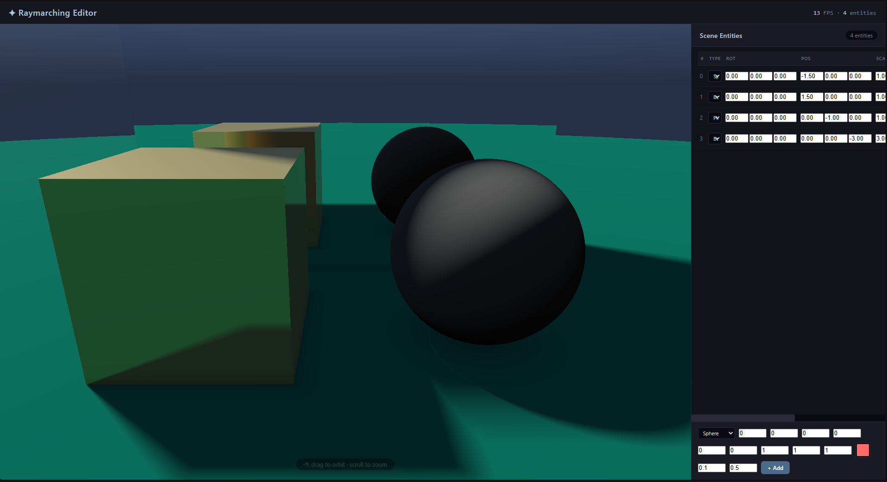

# Simple ray tracing shader with SDFs

## SDF

signed distance functions (SDFs) are a way to represent 3D shapes mathematically. They define a function that returns the shortest distance from any point in space to the surface of the shape. The sign of the distance indicates whether the point is inside or outside the shape.

YouTube video: [Coding Adventure: Ray Marching](https://www.youtube.com/watch?v=Cp5WWtMoeKg)

## Screenshot

